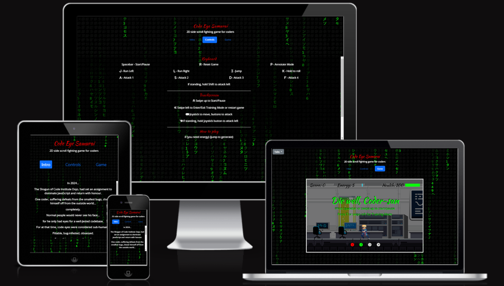
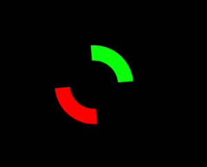
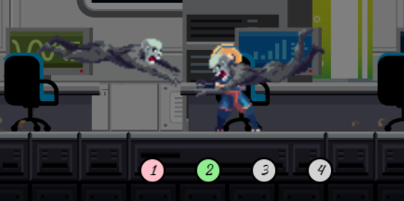

# Milestone 2 Project - Code Eye Samurai
By Gareth Llewelyn

[View website on GitHub Pages](https://llewbach.github.io/ci-samurai/)

## Table of contents

> 1. [Overview](#overview)
> 2. [UX](#ux)
>> 1. [Strategy](#strategy)
>> 2. [Scope](#scope)
>> 3. [Structure](#structure)
>> 4. [Skeleton](#skeleton)
>> 5. [Surface](#surface)
> 3. [Features](#features)
> 4. [Technologies Used](#technologies-used)
> 5. [Testing](#testing)
> 6. [Deployment](#deployment)
> 7. [Credits](#credits)
> 8. [Acknowledgements](#acknowledgements)

## Overview

[Back to top](#milestone-2-project---code-eye-samurai)

This is a side scroller fighting game using only vanilla Javascript. The game's shortened name (CI Samurai) is a nod to my code dojo, Code Institute.

## UX

[Back to top](#milestone-2-project---code-eye-samurai)

### Strategy

[Back to top](#milestone-2-project---code-eye-samurai)

The idea for this game was inspired by the Netflix show, 'Blue Eye Samurai' and also a deep empathy for my fellow coders battling with bugs on a daily basis. I decided that a game that offered coders sweet payback time in the form of a virtual rampage would be both of psychological benefit to the user, and of societal service by reducing the probability of a real one.

Creator's goals...
- wants to demonstrate skill with JavaScript
- wants to offer a safe means of decompressing to bug-beleaguered coders

Player's goals...
- wants to enjoy a game
- wants to decompress, and re-energize debugging mojo

Target audience...
- employers who will be considering the creator's proficiency
- seething coders who need their problems to just 'bug-ger off'

Unique selling proposition
- Game made specifically for the benefit of coders, and the CI community.

### Scope

[Back to top](#milestone-2-project---code-eye-samurai)

1) What the customer says they need - a fun game
2) What the customer actually needs - a morale boost for debugging
3) What the customer doesn't know they need - an urgent psychological decompression, and probably therapy

#### User Stories (US) and Acceptance Criteria (AC)

US1 - "As a site visitor, I want to know what the purpose of this site is and what kind of game it is so I can decide whether it's for me."

AC1 - "Users can immediately identify the game name, theme and type. Users are initially directed to the intro tab, where they can learn more about the game's lore".

US2 - "As an interested player, I want to be able to navigate intuitively through the site."

AC2 - "Users can navigate to any tab from any tab."

US3 - "As a convinced player, I want to learn to play the game."

AC3 - "Users are able to go through Training Mode to learn the game controls."

US4 - "As a hardcore gamer, I want a reward for beating the game."

AC4 - "Users are able to beat the game after reaching a sufficiently high score."

US5 - "As a touchscreen player, I want to be able to play the game on my touchscreen device."

AC5 - "Controls are set up to accomodate touchscreen users and the game's UI will tailor messages based on this automatically."

US6 - "As a user, I want the site to respond well to the dimensions of my screen."

AC6 - "The website will be made responsive to mobile screens (both portrait and landscape), tablets and desktops."

#### Information and features scope

This site will include information about the game, the game lore, game controls and game play.

In terms of the game's features, it will be limited to a 2d canvas, with only horizontal 'exploration'. The number of player states will allow convincing movement (standing, running, jumping, rolling), four modes of attack, a stun state and three end states. 

There will be two enemy types, with states that allow for more complex and exciting game play. These include two modes of appearance, two distinct forms of attack, hunting behaviour via the turning state and a death state. 

Both the player and enemy characters will be bidirectional. The background will have a parallax effect for a perception of depth. The game will also display information relevant to gameplay.

### Structure

[Back to top](#milestone-2-project---code-eye-samurai)

The information will be structured by three tabs, namely 'Intro', 'Controls' and 'Game'. This order makes sense as the player will want to know whether this is the sort of thing they want to play, how to use it, then use it.

Information relevant to game play will be visible in the game, including stats such as 'score', 'energy' and 'health', floating stat messages, and user interface (UI) messages as well. There will be attack option indicators at the bottom of the screen to quickly show which attack options are available based on current energy status.

### Skeleton

[Back to top](#milestone-2-project---code-eye-samurai)

Here are some wireframes of the site.

[Intro tab wireframe](assets/wireframes/Intro.png)

[Controls tab wireframe](assets/wireframes/Controls.png)

[Game tab wireframe](assets/wireframes/Game.png)

### Surface

[Back to top](#milestone-2-project---code-eye-samurai)

#### Background

The site background is a canvas element that creates a dynamic 'matrix rain' effect, that responds to the gameplay. This is reminiscent of 'hacker' and 'The One' vibes from the Matrix films, which add to the 'coder' theme and feel of the game.

#### Favicon

The player spritesheet pack that I bought came with an image of the player's head. I then used a [favicon converter](https://favicon.io/favicon-converter/) to generate the favicon images and link tags.

#### Fonts

From [Google Fonts](https://fonts.google.com/), I chose two fonts; [Kaushan Script](https://fonts.google.com/specimen/Kaushan+Script?query=kaushan+script) for larger text and [Open Sans](https://fonts.google.com/specimen/Open+Sans?query=open+sans) for smaller text. The Kaushan Script conveys more 'Japanese caligraphy' vibes in-line with the samurai theme. Open Sans helps legibility for smaller text.

#### Colour palette

I used [Coolors.co](https://coolors.co/) to consider different colour palettes, and despite your probable protests, I settled on the following.

I wanted the black and white elemental colours, along with three 'cyber' colours that support the 'coder' theme of the game.

## Features

[Back to top](#milestone-2-project---code-eye-samurai)

### Loader

While the site is loading, a 'loader' animation will be shown and disappear once the page has loaded.

### HTML and website structure

The website is one page with a Bootstrap tab menu, containing three tabs, 'Intro', 'Controls' and 'Game'. One advantage of this is that the player can pause the game, switch tab to refer to the controls and return to the game, thus avoiding page refreshes.

The Intro and Controls tab panes have limited heights which means the user has to scroll through the content within a static box. This works better with the background effect.

The 'Intro' tab pane - introduces the game's 'lore'.

The 'Controls' tab pane - introduces controls for keyboard players and touchscreen players as well as a section on gameplay.

The 'Game' tab pane - contains an absolutely positioned canvas element which will never have a width or height greater than the viewport. There is also an absolutely positioned dropdown menu in the top left corner. This is because the game canvas will sometimes cover the main tabs, when played on a landscape mobile for example. This extra dropdown thus provides a handy navigation alternative which doesn't get in the way of the game.

### Website background 

This is made up of a single canvas element, with an interactive 'matrix rain' effect. If the player is losing blood, the matrix rain colour will switch to red. If the player dies, the colour switches to white. If the game ends, the 'rain drop' frequency goes down by a factor of ten.

### Game background

This consists of 4 overlaid background images which move at different relative speeds in order to create a parallax effect. The endless effect is simulated by drawing one image before and after the central image and resetting the initial position of the images once the starting point of the central image reaches the starting point of the first or third image.

### Game

The game begins by offering a choice to start game or start Training Mode. 

Training mode provides a space for players to progress through levels if they successfully do what is asked of them, showing that they understand the controls. The player will also see messages that explain more aspects of gameplay.

The User Interface features a score count, an energy level bar and a health level bar.

Spacebar / Swiping up will toggle pause. When the game is paused a paused screen message will appear.

Pressing R / Swiping left will reset the game.

### Player

The player always remains in the center of the canvas, meaning that the illusion of motion is conveyed by setting the game speed to move in the opposite direction when the player is 'in motion'.

The player has the following possible states: Standing, Running, Jumping, Falling, Rolling, Stun, Attack1, Attack2, Attack3, Seppaku, Transcending, Attack4 and 'Demon'.

The player sprite is made bidirectional by setting a 'facingRight' property to either 1 or -1, which is then used to affect the canvas context's scale to flip it horizontally, and also to affect background motion and attack success.

Toggling the P keys will toggle 'annotate mode' which will display the game's hit boxes, which may be of help in understanding how the game works.

The blue boxes are 'hit' boxes. Red is the player's short-range attack box and black is the long-range attack box. 

You can see that the zombie's blue hitbox is currently outside of the player's short-range, but within the player's long-range. The player is currently outside of the zombie's attack range.

- Attack1 kills one enemy only within short-range.
- Attack2 kills all enemies within short-range. 
- Attack3 fries all enemies within long-range in one direction and provides +5 health. 
- Attack4 fries all enemies in long-range and provides +25 health.

The player has three stats, namely score, energy and health. 

### Enemies

There are two enemy drawings, as well as two modes of appearance.

Enemies have the following possible states: Standing, Walking, Dying, Spawning, Turning, Attack1, Attack2. The fact that zombies can turn via the Turning state allows for more 'realistic' hunting behaviour. On average around a fifth of zombies will use Attack2 (jumping).

As the game progresses, the average frequency of new zombie additions increases.

### Particles

Blood - As the zombies inflict damage on the player, they will trigger a spatter of player blood, and vice versa.

### Floating messages

Depending on game events, floating messages such as '+1' will appear and float towards to player's relevant stat. This provides clearer visual feedback of how the game works.

### Game controls

Keyboard - gameplay is controlled by I, J, K, L for motion and 'A', 'S', 'D' and 'F' keys for attacks.

Touchscreen - touchscreen controls are activated once a 'touch' event is detected on the window. These include a joystick for motion and control pad for attack options. The attack options will 'light up' if there is enough energy for them.

### UI

The User Interface displays game stats - score, energy and health. 

There are also attack option indicators at the bottom of the screen that light up if there is enough energy available to use them.

The UI will also feature messaging for the new game screen, a paused game, and different game endings. The UI messaging will also guide the player through the training mode. The messaging describing game controls will be relevant to keyboard players or touchscreen users. Note the image above instructs the touchscreen player to swipe up to continue, rather than press spacebar.

### 404 Page

This page catches users who try to navigate to a non-existant page. The user can click a link to return to the correct page.

### Future features

#### A global high score board

This would allow players to permanently record their high score and compete with other players around the world.

#### Vertical exploration

This could be done by integrating features of platform games to create more of a map.

#### Full use of possible sprite sheet animations

This could mean adding player states such as Defend, Dash, Aerial attack and all the Demon states, each with their own implications for gameplay. The enemy spritesheets also provide more possible enemy states such as Stun, and a second Dying state.

#### A Konami Code cheat

A Konami code is a classic cheat code for more retro games. Here is a Wikipedia description of it

> ...simply press ↑↑↓↓←→←→BA (sometimes followed by START and/or SELECT).[1] The code has also found a place in popular culture as a reference to the third generation of video game consoles[2] and is present as an Easter egg on several websites.

## Technologies used

[Back to top](#milestone-2-project---code-eye-samurai)

- HTML5
- CSS3
- [Bootstrap](https://getbootstrap.com/) framework
- Vanilla JavaScript
- [Jest](https://jestjs.io/)
- [GPT-4](https://chat.openai.com/) for help with debugging and looking things up
- [VSC](https://code.visualstudio.com/) development environment
- Windows PowerShell terminal
- Git for version control
- [GitHub](https://github.com/LlewBach/ci-samurai) for the online repository
- [GitHub Pages](llewbach.github.io/ci-samurai/) to deploy the site
- Balsamiq for wireframes
- [favicon.io](https://favicon.io/favicon-converter/) - Logo to Favicon converter
- [FontAwesome](https://fontawesome.com/) for icons
- [Google Fonts](https://fonts.google.com/)
- [Coolors.co](https://coolors.co/) was used to consider different colour palettes
- [Image Resizer.com](https://imageresizer.com/image-compressor) was used to compress images
- [The W3C Markup Validation Service](https://validator.w3.org/) was used to check HTML syntax
- [The W3C CSS Validation Service](https://jigsaw.w3.org/css-validator/) was used to check CSS syntax
- [WebAIM](https://wave.webaim.org/) was used to examine accessibility
- Chrome Dev Tools [Lighthouse](https://developer.chrome.com/docs/lighthouse/overview/) was used to test performance, accessibility, SEO and best practices
- [JSHint](https://jshint.com/)

## Testing

[Back to top](#milestone-2-project---code-eye-samurai)

### User Stories Testing

US1 - "As a site visitor, I want to know what the purpose of this site is and what kind of game it is so I can decide whether it's for me."

AC1 - "Users can immediately identify the game name, theme and type. Users are initially directed to the intro tab, where they can learn more about the game's lore".

> 1) Navigate to the website in Chrome browser.
> 2) Check that the game name, (Code Eye Samurai) and descriptive tag (2D side scroll fighting game for coders) are immediately visible.
> 3) Check that the navigation tabs are visible.
> 4) Check that the dynamic matrix rain background effect is working.
> 5) Check that the Intro tab content is visible and scrollable.

Test result: Pass.

US2 - "As an interested player, I want to be able to navigate intuitively through the site."

AC2 - "Users can navigate to any tab from any tab."

> 1) Navigate to the website in Chrome browser.
> 2) From the Intro tab, click on the Controls tab.
> 3) Check that the Controls tab pane content is visible and scrollable.
> 4) From the Controls tab pane, click on the Intro tab.
> 5) Check that the Intro tab pane content is visible. 
> 6) From the Intro tab pane, click on the Game tab.
> 7) Check that the Game canvas is visible, the new game message is showing and the game is paused.
> 8) From the Game tab, if the Intro tab is still visible, click on it, else skip to step 12.
> 9) Check that the Intro tab content is showing.
> 10) Navigate back to the Game tab and repeat for the Controls tab.
> 11) Navigate back to the Game tab.
> 12) From the Game tab, click on the dropdown menu and click on 'Intro'.
> 13) Check that the site navigates to the Intro tab.
> 14) Navigate back to the Game tab.
> 15) From the Game tab, click on the dropdown menu and click on 'Controls'.
> 16) Check that the site navigates to the Controls tab.

Test result: Pass.

US3 - "As a convinced player, I want to learn to play the game."

AC3 - "Users are able to go through Training Mode to learn the game controls."

> 1) Navigate to the website in Chrome browser.
> 2) Navigate to the Game tab..
> 3) Follow the UI instructions to begin the game in Training Mode.
> 4) Check that the Joystick and Control Pad are visible.
> 5) Follow the Training Mode instructions to pass each step to completion.

Test result: Pass.

US4 - "As a hardcore gamer, I want a reward for beating the game."

AC4 - "Users are able to beat the game after reaching a sufficiently high score."

> 1) Navigate to the website in Chrome browser.
> 2) Open the Game tab. 
> 3) Start a new game and play to reach a score of 333.
> 4) Check to see that a winning ending scene and message display.

Test result: Pass.

US5 - "As a touchscreen player, I want to be able to play the game on my touchscreen device."

AC5 - "A Joystick and Control Pad should be available for touchscreen players."

> 1) Navigate to the website in Chrome browser.
> 2) Open the Game tab.
> 3) Complete Training Mode.
> 4) Start a new game.
> 5) Check that the Joystick and Control Pad are visible and working.

Test result: Pass.

US6 - "As a user, I want the site to respond well to the dimensions of my screen."

AC6 - "The website will be made responsive to mobile screens (both portrait and landscape), tablets and desktops."

This is my testing procedure:

Setup

> 1) Open website in the Chrome browser, stay on the Intro tab.
> 2) Right click and click inspect.
> 3) Click the toggle device toolbar.

Testing function

> 4) From the device menu select the one being tested.
> 5) Check that both the title and tagline are visible.
> 6) Check that all three tab buttons are visible.
> 7) Check that the game initially displays the Intro tab pane.
> 8) Check that the Intro text doesn't extend beyond the bottom of the page. If the text is cut off before the bottom, check that it is scrollable within its container.
> 9) Try scrolling the whole page by swiping outside of the text box. The background should not scroll.
> 10) Check that the matrix rain effect is working and covers the whole screen area.
> 11) Click on the Controls tab.
> 12) Check that the Controls text doesn't extend beyond the bottom of the page. If the text is cut off before the bottom, check that it is scrollable within its container.
> 13) Try scrolling the whole page by swiping outside of the text box. The background should not scroll.
> 14) Click on the Game tab.
> 15) Check that the Tabs dropdown menu is visible in the top left corner.
> 16) Check that the page does not scroll either horizontally or vertically.
> 17) Check that the game does not extend beyond the viewport.

Here are the devices I tested with Chrome Dev Tools and the outcomes. In each row, I have listed the min-height media query that controls the view for the device being tested, listed in the next column.

<u>Touchscreen Devices</u>

| Min-Height Media Query | Device | Orientation | Test Result |
| :--------: | :-------: | :---------: | :---------: |
| 740px | Galaxy S8 | Portrait | Pass |
| 350px | Galaxy S8 | Landscape | Pass |
| 820px | iPhone 12 Pro | Portrait | Pass |
| 380px | iPhone 12 Pro | Landscape | Pass |
| 900px |iPhone 14 Pro Max | Portrait | Pass |
| 400px |iPhone 14 Pro Max | Landscape | Pass |
| 900px |Galaxy S20 Ultra | Portrait | Pass |
| 400px |Galaxy S20 Ultra | Landscape | Pass |
| 1000px |iPad Mini | Portrait | Pass |
| 740px |iPad Mini | Landscape | Pass |
| 1300px |iPad Pro | Portrait | Pass |
| 1000px |iPad Pro | Landscape | Pass |

<u>Monitor Resolutions</u>

| Min-Height Media Query | Screen Resolution | Test Result |
| :--------: | :-------: | :---------: |
| 540px | 1280 x 720 | Pass |
| 900px | 1920 x 1080 | Pass |
| 1300px | 2560 x 1440 | Pass |

### Browser Testing

To test the site on different browsers, I repeated the tests above, but without trying different resolutions. I then tested training mode, pausing/restarting the game, gameplay.

Chrome: Pass. Edge: Pass. Firefox: Pass.

I don't own a Safari device.

### Automated testing

#### HTML Validator

https://validator.w3.org/

Initially the validator raised issues with the fact that the spritesheet and background layer images had no alt text. Even though this would not be required at all due to how they are used, I gave each image alt text to appease the validator.

Result: Passed.

#### CSS Validator

https://jigsaw.w3.org/css-validator/

Result: Passed.

#### JSHint

I downloaded JSHint as a dev dependency and tested each .js file, including test.js files, with the linter. Here were some issues raised:

- Missing semi-colons
- Symbol class name confused for primitive built-in data type
- Uninitialized properties in player.js and enemies.js
- Unrecognized global variables in Jest tests

Solutions:
- Add missing semi-colons
- Change name of 'Symbol' class in matrix.js to 'Char'
- I initialized the properties with values such as '0'
- Warn JSHint to ignore Jest variables in .jshintrc file

All now pass without issue.

#### WAVE

I've had a look on [WAVE](https://wave.webaim.org/) (Web Accessibility Evaluation Tool) and the only issue that catches my eye is that is says low colour contrast, but I don't think the software can take the colour of the canvas background into account and assumes that the background colour of the page is white.

#### Lighthouse 

From my discussion with my mentor, a poorer Lighthouse Performance score is to be expected for a game. For this reason I included a 'loader' icon so that the user knows that taking some time to load is normal and to be expected. It also makes the wait a bit more interesting and might help to reduce the bounce rate.

#### Jest installation

Getting [Jest](https://jestjs.io/) set up so that it would work with VSC and modules actually proved to be quite difficult, but in the end I managed it by following these steps:

- Console command: npm init
- Console command: npm install --save-dev jest
- Console command: npm install --save-dev @babel/preset-env babel-jest
- Add to package.json: 
"babel": {
  "presets": ["@babel/preset-env"]
},
"type": "module"
- Console command: npm install --save-dev jest-environment-jsdom
- Add to package.json:
"jest": {
  "testEnvironment": "jsdom"
}

I also added the node_modules folder to the gitignore to not overload the git system.

#### Jest tests and exceptions

All aspects of the scripting are tested for with Jest, except for the following:
- main.js event listener functionality
- main.js Game.addEnemies method
- input.js ControlPad class addListeners method functionality
- input.js ControlPad draw method - Whether buttons change 'fillStyle' depending on energy level
- input.js Joystick class addListeners method functionality
- UI.js UI class draw method - Whether attack indicators change 'fillStyle' depending on energy level

This functionality is covered by behavioural testing the following: 
- Can one pause and restart the game on both keyboard and touchscreen? - Yes
- Can one toggle Annotate Mode by pressing P key on keyboard? - Yes
- Can one enter Training Mode on both keyboard and touchscreen? - Yes
- Does the background canvas automatically resize when the screen width is changed? - Yes
- Can the game sense a touchscreen device? - Yes
- Is the loader removed from the HTML once loaded? - Yes
- Can the game be played with the joystick and control pad? - Yes
- Do the buttons and indicators change colour depending on required energy level? - Yes

Each javascript file has a corresponding 'test.js' file. There are 11 test suites and 238 tests in total, which all pass. See the following image for a coverage report.

### Significant bugs

- When the screen size is changed dynamically, for example in Chrome Developer Tools - Device: Responsive, sometimes a small X and Y overflow appear. Upon page refresh however, these will disappear. Thus this bug should only affect a small number of edge cases.
- On the mobile version, swiping down (for example when moving joystick down with too long a swipe) really wants to make the page refresh.

## Deployment

[Back to top](#milestone-2-project---code-eye-samurai)

### GitHub Pages

This site was deployed to GitHub Pages following the steps below:
1) Log into GitHub.
2) Select the [LlewBach/ci-samurai](https://github.com/LlewBach/ci-samurai) repository.
3) Click on the "Settings" tab.
4) Scroll down to the 'Pages' section.
5) Ensure 'Source' is set to 'Deploy from a branch'.
6) Ensure the branch chosen is 'Main', from its '/(root)'.
7) Click 'Save'.
8) Refresh the page and at the top there will appear the link to the website. This link may take a few minutes to appear. Here is the link (https://llewbach.github.io/ci-samurai/).

### How to run this project locally

1. Download the IDE of your choice as well as Git.
1. Visit the GitHub repository for [ci-samurai](https://github.com/LlewBach/ci-samurai).
2. Click on "Code" and copy the HTTPS link.
3. Create the folder where you would like to save the repository.
4. In your terminal, navigate to the folder and then input 'git clone ', then paste the HTTPS link and press enter.
5. Open the folder in your IDE. Use the Live Server extension to view the HTML pages.

## Credits

[Back to top](#milestone-2-project---code-eye-samurai)

### Code

First and foremost, I would like to credit this amazing [JavaScript Game Development Course for Beginners](https://www.youtube.com/watch?v=GFO_txvwK_c). It was featured on freeCodeCamp.org's channel and the content came from the channel [Franks laboratory](https://www.youtube.com/c/Frankslaboratory).

To get a quick sense of the scope of this course, skip to 9:36:45 right at the end for an example of game play.

This course taught me the following:
- How to use sprite sheets and animate sprites on a canvas element
- How to use timestamps and deltaTime to make sure the game runs at the same speed on different machines
- How to create endlessly scrolling parallax backgrounds
- Object Orientated Programming
- State design pattern
- Collision detection
- Particle and floating text effects
- How to add touch events

A second tutorial by Frank that I followed was [Matrix Rain Experiments in JavaScript](https://www.youtube.com/watch?v=f5ZswIE_SgY). I took what I learned from this and used it as the background for my project. The only feature I added was to make it react to game play and state, by changing colour and intensity.

Thirdly, I would like to credit this tutorial on [Creating Analog Controller](https://www.youtube.com/watch?v=Wcml7OF6DNI) which got me started on creating the mobile joystick. I ended up redesigning this to work in a way I understood and added snapping behaviour. I also had to figure out myself how to make the touch coordinates translate into canvas coordinates if the canvas had been scaled down due to screen size.

Fourthly, I directly took what I learned from this tutorial, [How to Create and Display a Loading Spinner on Page Load](https://www.youtube.com/watch?v=q76TexbMXJg) and used it to create my spinner, making only minute changes, such as colours.

Finally, I would like to credit GPT-4 for teaching me most of what I know about Jest testing, and for the HTML script element that provides the dropdown menu link functionality.

### Art

The [samurai sprite sheet](https://chierit.itch.io/elementals-lightning-ronin) was bought from the artist 'chierit'.

The [zombie sprite sheets](https://ggoolmool.itch.io/zombie) was bought from the artist 'ggoolmool'.

The [background layers](https://bevouliin.com/science-laboratory-game-background/) were bought from the artist 'bevouliin'.

The 404 page background image was created my GPT-4.

## Acknowledgements

[Back to top](#milestone-2-project---code-eye-samurai)

I'd like to thank my mentor Ben Kavanagh, a veritable Ode to Code, for his support.